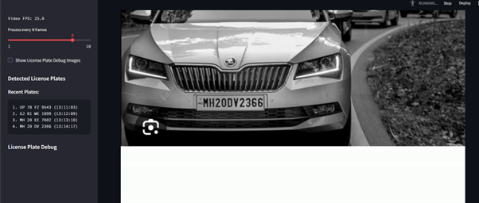

# AirVision Analytics Dashboard

## Overview
AirVision Analytics Dashboard is a real-time video analysis web application built with Streamlit and OpenCV. It leverages deep learning models for vehicle counting, license plate recognition, face recognition, and crowd analysis. The app supports multiple video sources including webcam, uploaded videos, and drone feeds.

## Features
- **Vehicle Count:** Detects and counts vehicles in video frames using YOLOv8.
- **License Plate Recognition:** Identifies and formats Indian license plates using a custom model.
- **Face Recognition:** Detects and recognizes faces using YOLOv8-face and Facenet models, with distance estimation.
- **Crowd Analysis:** (Model placeholder, add model to `models/crowd_analysis.pt` for activation.)
- **Multi-source Input:** Supports webcam, file upload, and drone video stream URLs.
- **Interactive UI:** Real-time results, debug images, and persistent sidebar containers for results.

## Project Structure
```
app.py                      # Main Streamlit app
requirementts.txt           # Python dependencies
models/                     # Pre-trained model files
  facenet.pt
  Licence.pt
  yolov8n-face.pt
  yolov8n.pt
  crowd_analysis.pt (add for crowd analysis)
dataset/                    # Directory for known faces and uploads
  sai/
    1.jpeg                  # Example image
utils/
  face_embedding.py         # Face embedding and recognition logic
  inference.py              # Model loading and inference functions
```

## Installation
1. **Clone the repository:**
   ```powershell
   git clone <repo-url>
   cd "d:\sai\Avironix\AirVision Analytics Dashboard"
   ```
2. **Install dependencies:**
   ```powershell
   pip install -r requirementts.txt
   ```
3. **Add models:**
   Place the required `.pt` model files in the `models/` directory.

## Usage
1. **Run the app:**
   ```powershell
   streamlit run app.py
   ```
2. **Select video source and analysis modules in the UI.**
3. **View results and debug images in real time.**

## Output Screenshots
Add screenshots of:
- Main dashboard UI
- Vehicle count overlay
- License plate recognition sidebar
- Face recognition sidebar
- Debug images (license plate, face recognition)

Place your screenshots in a folder named `screenshots/` and reference them below:

### Example Screenshots





## Notes
- For crowd analysis, add `crowd_analysis.pt` to the `models/` directory.
- Known faces for recognition should be placed in `dataset/`.
- The app is designed for Windows and uses PowerShell commands in this README.

## License
Specify your license here.

## Contact
For support, contact [your-email@example.com].
